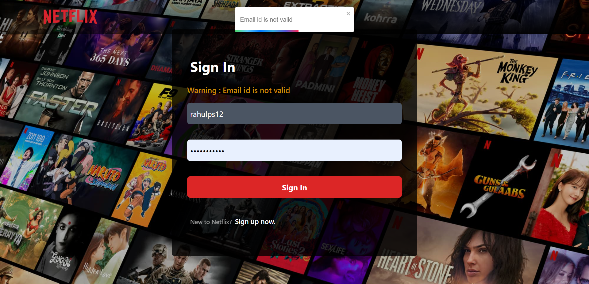
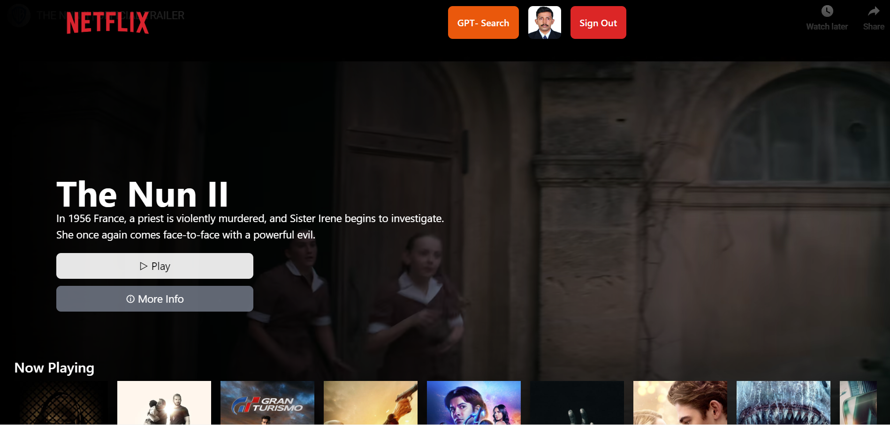
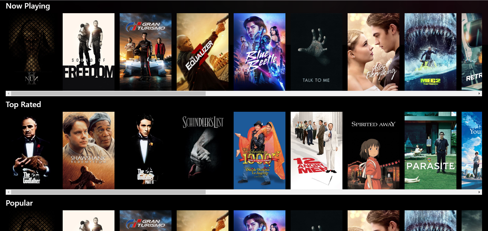
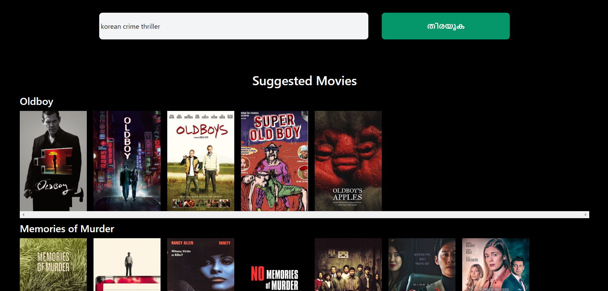
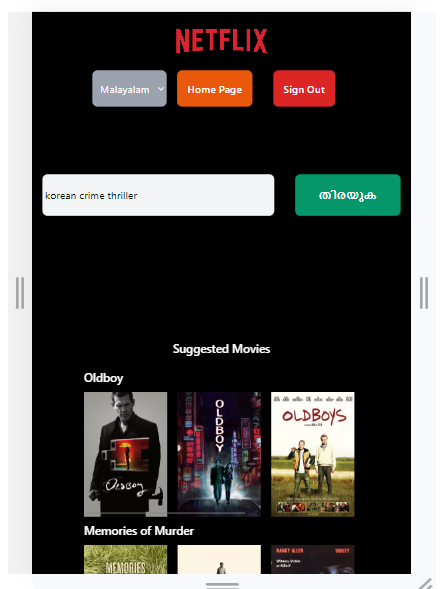

# Getting Started with Create React App

This project was bootstrapped with [Create React App](https://github.com/facebook/create-react-app).

## Available Scripts

In the project directory, you can run:

### `npm start`

Runs the app in the development mode.\
Open [http://localhost:3000](http://localhost:3000) to view it in your browser.

The page will reload when you make changes.\
You may also see any lint errors in the console.

### `npm test`

Launches the test runner in the interactive watch mode.\
See the section about [running tests](https://facebook.github.io/create-react-app/docs/running-tests) for more information.

### `npm run build`

Builds the app for production to the `build` folder.\
It correctly bundles React in production mode and optimizes the build for the best performance.

The build is minified and the filenames include the hashes.\
Your app is ready to be deployed!

See the section about [deployment](https://facebook.github.io/create-react-app/docs/deployment) for more information.

### `npm run eject`

**Note: this is a one-way operation. Once you `eject`, you can't go back!**

If you aren't satisfied with the build tool and configuration choices, you can `eject` at any time. This command will remove the single build dependency from your project.

Instead, it will copy all the configuration files and the transitive dependencies (webpack, Babel, ESLint, etc) right into your project so you have full control over them. All of the commands except `eject` will still work, but they will point to the copied scripts so you can tweak them. At this point you're on your own.

You don't have to ever use `eject`. The curated feature set is suitable for small and middle deployments, and you shouldn't feel obligated to use this feature. However we understand that this tool wouldn't be useful if you couldn't customize it when you are ready for it.

## Learn More

You can learn more in the [Create React App documentation](https://facebook.github.io/create-react-app/docs/getting-started).

To learn React, check out the [React documentation](https://reactjs.org/).

### Code Splitting

This section has moved here: [https://facebook.github.io/create-react-app/docs/code-splitting](https://facebook.github.io/create-react-app/docs/code-splitting)

### Analyzing the Bundle Size

This section has moved here: [https://facebook.github.io/create-react-app/docs/analyzing-the-bundle-size](https://facebook.github.io/create-react-app/docs/analyzing-the-bundle-size)

### Making a Progressive Web App

This section has moved here: [https://facebook.github.io/create-react-app/docs/making-a-progressive-web-app](https://facebook.github.io/create-react-app/docs/making-a-progressive-web-app)

### Advanced Configuration

This section has moved here: [https://facebook.github.io/create-react-app/docs/advanced-configuration](https://facebook.github.io/create-react-app/docs/advanced-configuration)

### Deployment

This section has moved here: [https://facebook.github.io/create-react-app/docs/deployment](https://facebook.github.io/create-react-app/docs/deployment)

### `npm run build` fails to minify

This section has moved here: [https://facebook.github.io/create-react-app/docs/troubleshooting#npm-run-build-fails-to-minify](https://facebook.github.io/create-react-app/docs/troubleshooting#npm-run-build-fails-to-minify)

## features

- Firebase WEB modular API for create account & login
- deploy app to production (firebase hosting)
- create signUp user account
- Implement user SignIn
- created Redux store with user slice
- created redux store ,userSlice
- implemented Sign Out
- Updated profile with display name and profile picture
- fetch movies from TMDB Movies
- If the user is not logged, redirect to the login page and visa-versa;
- unScribed to the onAuthStateChanged Callback
- Register in TMDB API ,create app, & get access token
- Get data from TMDB npw playing movies list api 
- adding movie data to store, create slice for movies
- custom hooks for getting now playing movies &  reduce codes in browse component
- planning for main container and secondary container 
- fetching data for trailer and custom hook for that
-embedded youtube video with auto  play 
- built secondary component
- built movie list and  Movie card component
- TMDB image cdn
- added more category of movies list and custom hooks for that
- Gpt search feature
- button for search page
- GPT-search Bar
- memoization for API call
- fetched gpt movieSuggestion from tmdb
- reused movie list component to make movie suggestion container
- Multi language Feature
- Integrate Open api 
- generated result from  gpt as per our input
- used that as input for find movie information from TMDm
- added both result  to  store using single action
- updated UI with new results
- re used component to show the movie result (movieList component)
- Add .env file for storing the secrets and api keys
- adding env to git ignore
- made site responsive
- changed favicon and title

## Screen Shots
Firebase secured login with validation

Home Page

Different Category

 Multi language Feature

Chat GPT suggested movies list

Responsive Design

